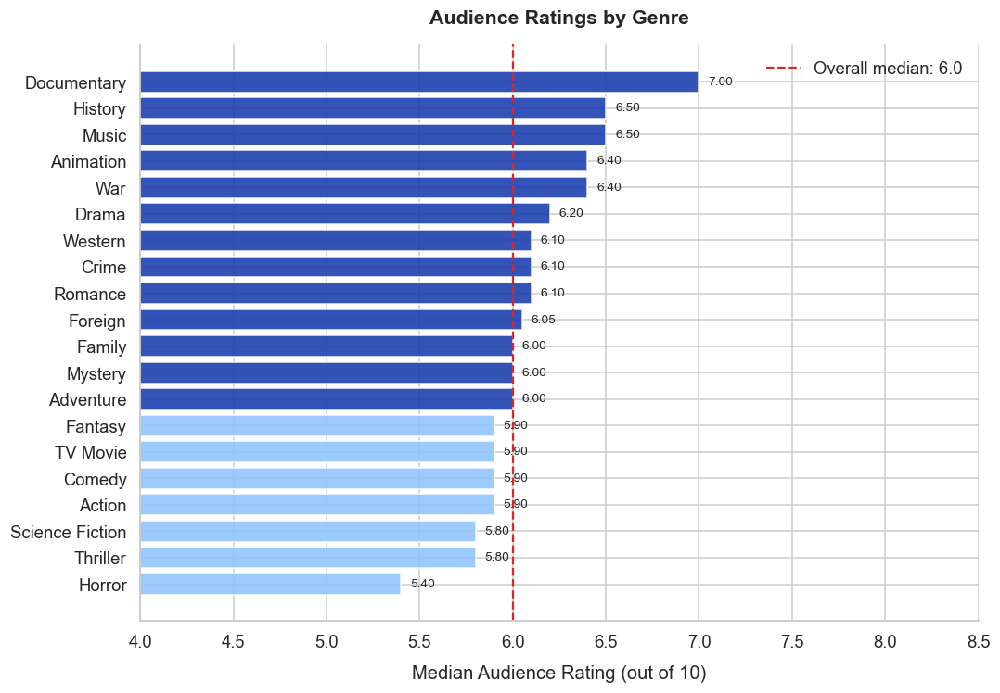
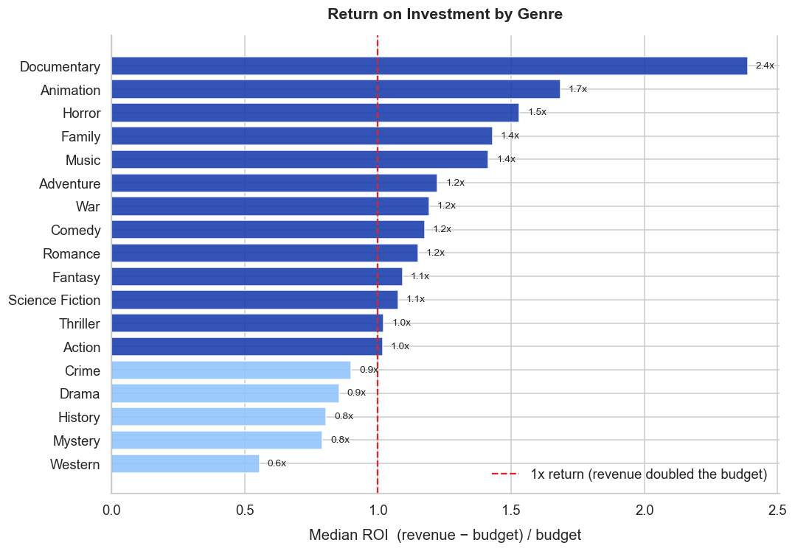
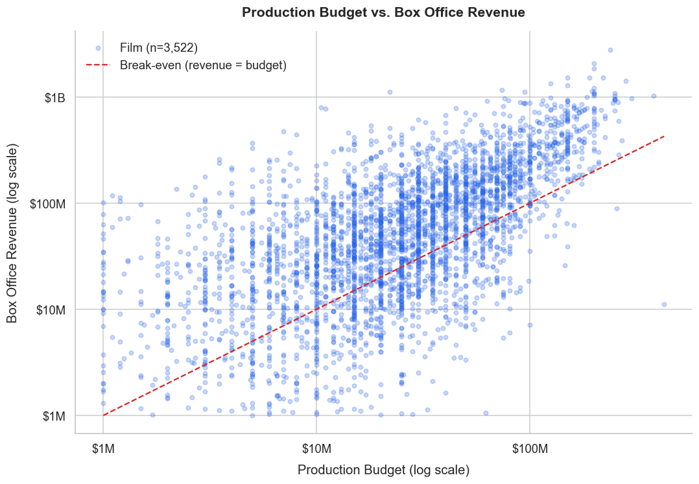
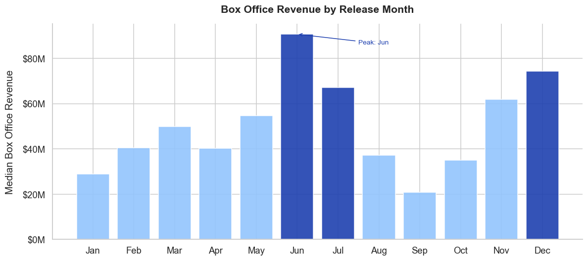
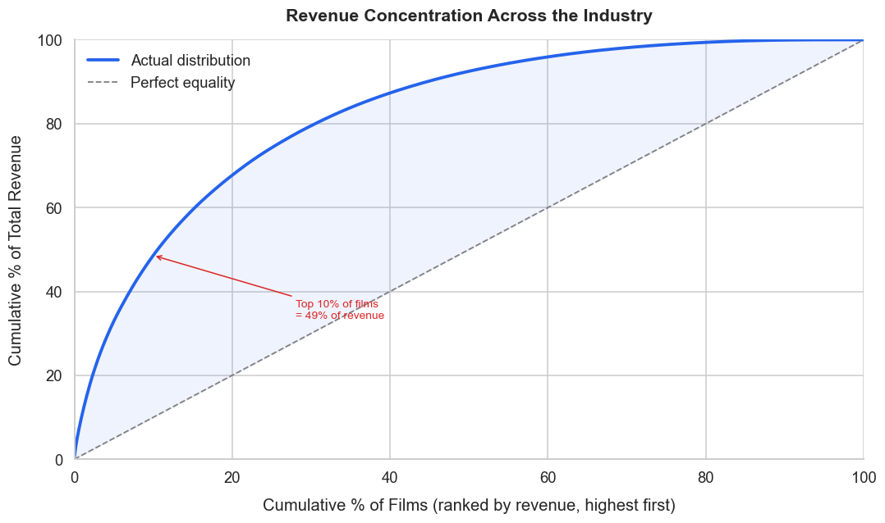

# TMDB Movie Industry Analysis

Exploratory data analysis of 10,000+ films to identify the patterns behind
box office performance — from genre ROI to release timing and revenue concentration.

**Tools:** Python · pandas · seaborn · matplotlib &nbsp;|&nbsp; **Dataset:** TMDb Movie Dataset (1960–2015)

---

## The Business Question

Film studios commit hundreds of millions before knowing if a project will succeed.
This analysis tackles five questions a production or distribution analyst would
actually need to answer:

1. Which genres earn the highest audience ratings?
2. Which genres generate the best return on investment?
3. What is the true relationship between budget and revenue?
4. Does release timing affect box office performance?
5. How concentrated is revenue across the industry?

---

## Key Findings

**Horror is the most capital-efficient genre.**
Despite lower audience ratings, Horror consistently delivers strong ROI — because
production costs are a fraction of blockbuster genres while returns remain competitive.

**High budget does not guarantee high return.**
The break-even analysis shows many large-budget productions underperform.
Mid-budget films ($20–80M) often deliver stronger ROI than $200M+ productions.

**Summer and holidays dominate — by a wide margin.**
Films released in May–July and November–December earn significantly higher median
revenue. January and September are the weakest windows.

**Revenue is extremely concentrated.**
A small fraction of films accounts for the majority of total industry revenue.
This means average revenue is a misleading benchmark — median tells a very different story.

---

## Dashboard

### Audience Ratings by Genre


### Return on Investment by Genre


### Production Budget vs. Box Office Revenue


### Box Office Revenue by Release Month


### Revenue Concentration Across the Industry


---

## Methodology

**Dataset:** 10,866 films from the TMDb Movie Dataset, covering 1960–2015.

**Key cleaning decisions:**
- Removed 1 duplicate row
- Dropped columns with high missing rates (homepage, tagline, keywords)
- Filtered out films with `budget = 0` or `revenue = 0` (~50% of rows) for financial analysis — these represent unreported data, not genuinely zero-cost productions
- Calculated ROI as `(revenue − budget) / budget`

Two datasets are used: the full dataset for ratings and release analysis, and a financial subset (~3,800 films) where both budget and revenue were reported.

---

## Project Structure

```
tmdb-movie-data-analysis/
├── tmdb_movie_analysis.ipynb   # Main analysis notebook
├── data/
│   └── tmdb-movies.csv         # Source dataset (not tracked — see below)
├── images/                     # Chart exports (generated by running the notebook)
├── .gitignore
└── README.md
```

> **To run the notebook:** place `tmdb-movies.csv` in the `data/` folder, then run all cells.
> The dataset is available on [Kaggle — TMDB 5000 Movie Dataset](https://www.kaggle.com/datasets/tmdb/tmdb-movie-metadata).

---

## Skills Demonstrated

- Exploratory data analysis with pandas
- Data quality assessment and cleaning decisions
- Genre analysis with multi-value column expansion
- ROI calculation and financial performance benchmarking
- Seaborn and matplotlib visualisation with consistent theming
- Business-oriented framing of analytical findings
